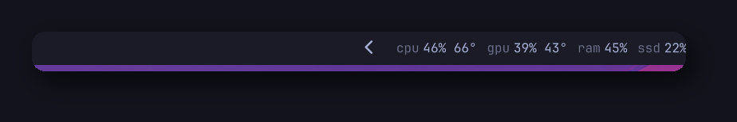

# blitz.stats



Omarchy bar chip for CPU, RAM, disk, GPU, and network. Values come from local `/proc` and `nvidia-smi` when present.

```bash
omarchy plugin add https://github.com/itz4blitz/blitz.stats.git --enable
omarchy plugin update blitz.stats
```
